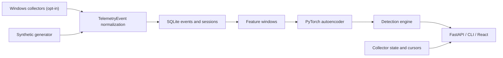

# Architecture

SentinelUEBA Stage 1 is a local modular monolith. The backend owns telemetry generation, opt-in Windows collectors, normalization, storage, feature engineering, model training, inference, detection, and collection-session accounting. The frontend calls FastAPI endpoints and renders pipeline status plus anomaly and collector results.

The primary identity boundary is `user_id + host_id`. Synthetic events use safe demo identifiers. Real Windows events use pseudonymous local identifiers by default; raw identity mode is explicit configuration only.

Stage 1 uses 15-minute non-overlapping windows. This keeps the demo fast and gives enough density for process, network, metrics, and authentication features. Synthetic and real events are filtered separately for training and detection.

