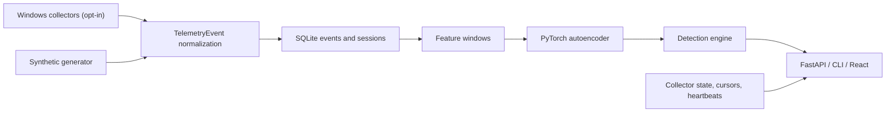

# Architecture

SentinelUEBA Stage 1 is a local modular monolith. The backend owns telemetry generation, opt-in Windows collectors, normalization, storage, feature engineering, model training, inference, detection, and collection-session accounting. The frontend calls FastAPI endpoints and renders pipeline status plus anomaly and collector results.

The primary identity boundary is `user_id + host_id`. Synthetic events use safe demo identifiers. Real Windows events use pseudonymous local identifiers by default; raw identity mode is explicit configuration only.

Stage 1 uses 15-minute non-overlapping windows. This keeps the demo fast and gives enough density for process, network, metrics, and authentication features. Synthetic and real events are filtered separately for training and detection.

Collection-session duration uses persisted heartbeats, not wall-clock gaps between application runs. Stale running sessions are closed at their last heartbeat during recovery.

Demo scenario validation is a post-inference reporting step. It compares the full anomaly list to the synthetic scenario manifest and is not an input to the model or feature pipeline.

## Stage 2 Data Pipeline

Stage 2 keeps the modular monolith and adds explicit boundaries for validation,
ingestion, data quality, feature materialization, dataset snapshots, and retention.
SQLite schema v4 stores ingestion metadata, `quarantined_events`, `feature_windows`,
`feature_materialization_state`, `data_quality_runs`, and `dataset_snapshots`.

Feature windows are 15-minute UTC tumbling windows partitioned by dataset kind and
user+host profile. Autoencoder training now reads a verified Parquet dataset snapshot
instead of arbitrary current SQLite event contents. See `DATA_PIPELINE.md` for the full
flow and Mermaid diagram.
