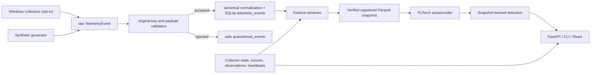

# Architecture

SentinelUEBA Stage 2 is a local modular monolith. The backend owns telemetry generation,
opt-in Windows collectors, validation, canonical normalization, storage, feature
materialization, dataset snapshots, model training, inference, detection, and collection
accounting. The frontend calls FastAPI endpoints and renders pipeline status plus anomaly
and collector results.

The primary identity boundary is `user_id + host_id`. Synthetic events use safe demo identifiers. Real Windows events use pseudonymous local identifiers by default; raw identity mode is explicit configuration only.

Stage 2 uses 15-minute non-overlapping UTC windows. This keeps the demo fast and gives enough density for process, network, metrics, and authentication features. Synthetic and real events are filtered separately for training and detection.

Collection-session duration uses persisted heartbeats, not wall-clock gaps between application runs. Stale running sessions are closed at their last heartbeat during recovery.

Demo scenario validation is a post-inference reporting step. It compares the full anomaly list to the synthetic scenario manifest and is not an input to the model or feature pipeline.

## Stage 2 Data Pipeline

Stage 2 keeps the modular monolith and adds explicit boundaries for validation,
ingestion, data quality, feature materialization, dataset snapshots, and retention.
SQLite schema v6 stores ingestion metadata, `quarantined_events`, `feature_windows`,
`feature_materialization_state`, `collector_observations`, late/duplicate event records,
`data_quality_runs`, and `dataset_snapshots`. The v6 materialization state includes the
composite observation watermark `last_observation_at + last_observation_id`.

Feature windows are 15-minute UTC tumbling windows partitioned by dataset kind and
user+host profile. For real data, quality is based on collector observations rather than
event counts or raw session duration. Incremental materialization reads observations by
`(observed_at, observation_id)` and selects affected observations by coverage-interval
overlap. Autoencoder training and offline detection read a verified registered Parquet
dataset snapshot instead of arbitrary current SQLite event contents.
See `DATA_PIPELINE.md` for the full flow and Mermaid diagram.
