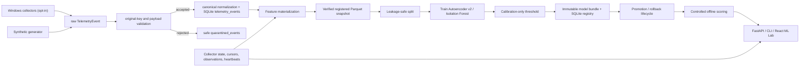

# Architecture

SentinelUEBA Stage 3 is a local modular monolith. The backend owns telemetry generation, opt-in Windows collectors, validation, canonical normalization, storage, feature materialization, dataset snapshots, model training, calibration, registry-backed promotion, offline scoring, drift reports, and collection accounting. The frontend calls FastAPI endpoints and renders pipeline, collector, anomaly, and ML Lab results.

The primary identity boundary is `user_id + host_id`. Synthetic events use safe demo identifiers. Real Windows events use pseudonymous local identifiers by default; raw identity mode is explicit configuration only.

Stage 3 uses 15-minute non-overlapping UTC windows. Synthetic and real data are partitioned by dataset kind and profile for snapshots, training, scoring, and drift checks.

Collection-session duration uses persisted heartbeats, not wall-clock gaps between application runs. Stale running sessions are closed at their last heartbeat during recovery.

Demo scenario validation is a post-inference reporting step. It compares the full anomaly list to the synthetic scenario manifest and is not an input to the model or feature pipeline.

## Stage 2 Data Pipeline

Stage 2 added explicit boundaries for validation, ingestion, data quality, feature materialization, dataset snapshots, and retention. SQLite schema v6 stores ingestion metadata, `quarantined_events`, `feature_windows`, `feature_materialization_state`, `collector_observations`, late/duplicate event records, `data_quality_runs`, and `dataset_snapshots`. The v6 materialization state includes the composite observation watermark `last_observation_at + last_observation_id`.

Feature windows are 15-minute UTC tumbling windows partitioned by dataset kind and user+host profile. For real data, quality is based on collector observations rather than event counts or raw session duration. Incremental materialization reads observations by `(observed_at, observation_id)` and selects affected observations by coverage-interval overlap.

## Stage 3 ML Pipeline

SQLite schema v7 adds `training_runs`, `model_versions`, `model_evaluations`, `model_promotions`, `scoring_runs`, and `scored_windows`. Model bundles are immutable directories under the configured local model artifact root. Each bundle includes `manifest.json`, `split.json`, `preprocessor.json`, `metrics.json`, `model_card.md`, `checksums.sha256`, and exactly one family artifact: `autoencoder.pt` or `isolation_forest.skops`.

Synthetic snapshots split chronologically at the first scenario window: prior normal windows become train/calibration, and all scenario windows stay in test. Real snapshots use chronological 70/15/15 splits over good windows only. The preprocessor is fitted on train rows only. Thresholds are calibrated only from calibration scores. Synthetic labels are used only for held-out evaluation and recommendation.

Offline scoring requires a verified registered model bundle and a verified registered dataset snapshot. The service checks dataset kind, profile key, feature schema, feature order, manifest hashes, artifact hashes, and threshold metadata before writing immutable `scoring_runs` and `scored_windows`.
