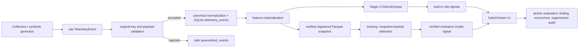
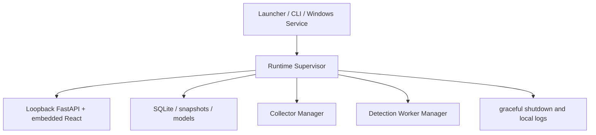

# Architecture

SentinelUEBA Stage 5 is a local modular monolith. The backend owns telemetry generation, opt-in Windows collectors, validation, canonical normalization, storage, feature materialization, dataset snapshots, model training, calibration, registry-backed promotion, offline scoring, drift reports, collection accounting, the Stage 4 detection engine, and the Stage 5 runtime supervisor. The frontend calls same-origin FastAPI endpoints in packaged mode and the Vite proxy in development.

The primary identity boundary is `user_id + host_id`. Synthetic events use safe demo identifiers. Real Windows events use pseudonymous local identifiers by default; raw identity mode is explicit configuration only.

Stage 3 uses 15-minute non-overlapping UTC windows. Synthetic and real data are partitioned by dataset kind and profile for snapshots, training, scoring, and drift checks.

```mermaid
flowchart LR
  A["Windows collectors (opt-in)"] --> B["raw TelemetryEvent"]
  C["Synthetic generator"] --> B
  B --> D["original-key and payload validation"]
  D -->|accepted| E["canonical normalization + SQLite telemetry_events"]
  D -->|rejected| Q["safe quarantined_events"]
  E --> F["Feature materialization"]
  F --> J["Verified registered Parquet snapshot"]
  J --> K["Leakage-safe split"]
  K --> L["Train Autoencoder v2 / Isolation Forest"]
  L --> M["Calibration-only threshold"]
  M --> N["Pending bundle verification"]
  N --> O["Atomic training finalize + verified_at"]
  O --> P["Promotion / rollback lifecycle"]
  P --> R["Controlled offline scoring"]
  P --> S["Verified champion model signal"]
  F --> T["DetectionInput (safe feature-window contract)"]
  T --> U["Built-in rule signals"]
  S --> V["hybrid-fusion-v1"]
  U --> V
  V --> W["Detection evaluation"]
  W --> X["Finding / occurrence / lifecycle / suppression audit"]
  R --> H["FastAPI / CLI / React ML Lab"]
  X --> Y["FastAPI / CLI / React Detection Center"]
  I["Collector state, cursors, observations, heartbeats"] --> F
  I --> H
```

Collection-session duration uses persisted heartbeats, not wall-clock gaps between application runs. Stale running sessions are closed at their last heartbeat during recovery.

Demo scenario validation is a post-inference reporting step. It compares the full anomaly list to the synthetic scenario manifest and is not an input to the model or feature pipeline.

## Stage 2 Data Pipeline

Stage 2 added explicit boundaries for validation, ingestion, data quality, feature materialization, dataset snapshots, and retention. SQLite schema v6 stores ingestion metadata, `quarantined_events`, `feature_windows`, `feature_materialization_state`, `collector_observations`, late/duplicate event records, `data_quality_runs`, and `dataset_snapshots`. The v6 materialization state includes the composite observation watermark `last_observation_at + last_observation_id`.

Feature windows are 15-minute UTC tumbling windows partitioned by dataset kind and user+host profile. For real data, quality is based on collector observations rather than event counts or raw session duration. Incremental materialization reads observations by `(observed_at, observation_id)` and selects affected observations by coverage-interval overlap.

## Stage 3 ML Pipeline

SQLite schema v8 stores Stage 2 feature-store tables plus `training_runs`, `model_versions`, `model_evaluations`, `model_promotions`, `scoring_runs`, and `scored_windows`. Schema v8 makes `model_promotions.new_model_id` nullable so retirement audit history records `NULL` for the absent successor. Model bundles are immutable directories under the configured local model artifact root. Each bundle includes `manifest.json`, `split.json`, `preprocessor.json`, `metrics.json`, `model_card.md`, `checksums.sha256`, and exactly one family artifact: `autoencoder.pt` or `isolation_forest.skops`. `manifest.artifact_hashes` anchors the split, preprocessor, metrics, model card, and model artifact hashes; `checksums.sha256` must match the same hashes.

Synthetic snapshots split chronologically at the first scenario window: prior normal windows become train/calibration, and all scenario windows stay in test. Real snapshots use chronological 70/15/15 splits over good windows only. The preprocessor is fitted on train rows only. Thresholds are calibrated only from calibration scores. Synthetic labels are used only for held-out evaluation and recommendation.

Bundle creation uses internal temp-bundle verification before atomic rename and private pending registered verification after `model_versions` registration. After all candidates are registered and evaluated, one SQLite transaction marks the training run `success`, records `completed_at`, and fills `verified_at` for every candidate model. Public verification requires a registered verified source dataset snapshot, exact registry/manifest/training-run agreement, matching artifact path, model input dimension, a successful completed training run, and supported library-safe artifact loading.

Offline scoring requires a verified registered model bundle and a verified registered dataset snapshot. The compatibility service checks dataset kind, profile key, feature schema, feature order, manifest hashes, artifact hashes, and threshold metadata before writing `scoring_runs` and `scored_windows`. A scoring run is inserted as `running` before model loading; success inserts rows atomically, and failure records a sanitized error without partial scored rows.

The React ML Lab renders synthetic/real dataset controls, model family/config controls, training runs, model details, scoring-run details, drift details, candidate/recommended/champion lifecycle actions, verification state, and legacy Stage 2 artifact detection. Lifecycle actions require a browser confirmation before the API receives `confirm=true`. The UI shows pseudonymous profile labels and shortened hashes rather than raw users, hosts, local artifact paths, executable paths, network addresses, or payloads.

## Stage 4 Detection Engine

SQLite schema v10 stores Stage 4 tables: `detection_policies`, `detection_policy_activations`, `detection_runs`, `detection_evaluations`, `findings`, `finding_occurrences`, `finding_state_history`, `detection_suppressions`, `detection_watermarks`, and `detection_worker_leases`. Fresh databases and historical databases migrate sequentially to v10; a database that claims v10 but lacks required tables or columns fails schema integrity checks.

Detection is validation- and feature-window-backed. `DetectionInput` contains only the window id, dataset kind, pseudonymous profile key, window bounds, feature schema version, ordered `FEATURE_NAMES`, numeric feature values, data quality, and feature input hash. It never includes raw telemetry payloads, raw user or host values, executable paths, remote addresses, authentication identities, or synthetic scenario labels.

The built-in policy is `hybrid-policy-v1`, mode `hybrid`. Its rules are `rare-process-v1`, `new-remote-spike-v1`, `unusual-hour-activity-v1`, `resource-pressure-v1`, and `authentication-failure-burst-v1`. The fusion method is deterministic and explainable; corroboration increases the score, weak single signals do not become critical, and the output is a triage finding rather than proof of compromise.

## Stage 5 Runtime

Packaged desktop mode uses `%LOCALAPPDATA%\SentinelUEBA`; service mode uses `%PROGRAMDATA%\SentinelUEBA`. The installation directory is read-only compatible and contains shipped binaries, docs, embedded frontend assets, and the release manifest. Runtime data, logs, databases, snapshots, and model artifacts are not written to the package directory.

The host binds only to `127.0.0.1`. Mutating HTTP endpoints require a per-process control token in `X-SentinelUEBA-Control-Token`. `GET /runtime/build` and `GET /runtime/status` return safe metadata without absolute paths or tokens.

Model signals are loaded only through the public Stage 3 verifier and SQLite registry. A user cannot provide an artifact path. Direct persisted feature-window scoring is used only for Stage 4 detection, not for training, calibration, evaluation, promotion, or drift. Scoring is exact by dataset/profile/model namespace; no-profile requests fan out into per-profile child runs instead of mixing profiles in one run.

The local worker is a controlled foreground/API worker lease, not an installed Windows Service or autostart mechanism. API start uses a process-level manager keyed by database path and worker key so start/stop/status share thread state across requests; public status returns an allowlist and never exposes owner ids, hostnames, thread ids, config JSON, or local paths. Watermarks are keyed by dataset kind, profile, policy hash, and model identity so policy or champion changes trigger fresh evaluations without silently rescoring history. Pending detection windows are selected by SQL anti-join; watermarks are only an audit/optimization aid and not a replacement for idempotency. Registered-snapshot backfill verifies the public snapshot and proves current feature windows still match the snapshot rows before processing exactly those window ids.
