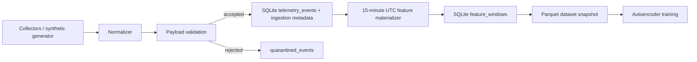

# SentinelUEBA Data Pipeline

Stage 2 adds a reproducible local pipeline:



The project remains a modular monolith. SQLite stores raw events, quarantine records,
collection metadata, materialized feature windows, materialization state, quality runs,
and dataset snapshot registry rows. Generated databases, snapshots, models, logs, and
local identities stay outside Git.

## Versions

- Event schema: `event-v1`
- Feature schema: `feature-windows-v2`
- Dataset manifest: `dataset-manifest-v1`
- SQLite schema: v4

## Materialization

Stage 2 uses deterministic 15-minute tumbling windows aligned to UTC. Windows are
partitioned by `dataset_kind`, `user_id`, and `host_id`; profiles are never mixed.
Materialization sorts events once, groups them by profile and window, and calculates the
Stage 0 feature set deterministically.

The materializer stores a watermark in `feature_materialization_state`. Re-runs are
idempotent. The default late-event interval is 60 minutes. Events inside that interval
invalidate the affected window range; the materializer recomputes from the affected
window forward with a deterministic baseline for `new_process_count` and
`new_remote_count`.

Use:

```bash
sentinelueba features materialize --dataset synthetic
sentinelueba features rebuild --dataset synthetic
sentinelueba features status
```

## Dataset Snapshots

Training uses immutable Parquet snapshots under:

```text
data/datasets/<dataset-id>/
  features.parquet
  manifest.json
  checksums.sha256
```

Snapshots include only feature windows and ML metadata by default. Raw event payloads are
not included. Creating new data produces a new dataset id; existing snapshots are not
modified in place.
