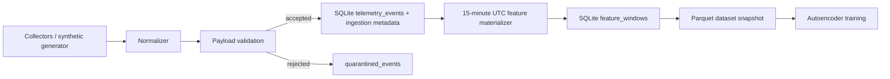

# SentinelUEBA Data Pipeline

Stage 2 adds a reproducible local pipeline:



The project remains a modular monolith. SQLite stores raw events, quarantine records,
collection metadata, materialized feature windows, materialization state, quality runs,
and dataset snapshot registry rows. Generated databases, snapshots, models, logs, and
local identities stay outside Git.

## Versions

- Event schema: `event-v1`
- Feature schema: `feature-windows-v2`
- Dataset manifest: `dataset-manifest-v1`
- SQLite schema: v5

## Materialization

Stage 2 uses deterministic 15-minute tumbling windows aligned to UTC. Windows are
partitioned by `dataset_kind`, `user_id`, and `host_id`; profiles are never mixed.
Materialization sorts events once, groups them by profile and window, and calculates the
Stage 0 feature set deterministically.

SQLite schema v5 adds `collector_observations` and richer
`feature_materialization_state` fields: the last ingestion watermark, stable event id
tie-breaker, event-time watermark, observation watermark, and last successful run time.
Re-runs with no new events or observations return zero processed, upserted, and deleted
rows and do not update timestamps.

Normal incremental runs read new events by ingestion watermark and new observations by
observation watermark, derive affected 15-minute windows, then load only events and
observations in the affected range. Novelty features use a SQL baseline query for
processes and remote endpoints before the affected window, so unchanged history is not
loaded into Python on each run. Full rebuild remains the explicit path that reads all
history.

The default late-event interval is 60 minutes. Late events inside that interval invalidate
the affected window range; late events outside the interval are recorded for quality
reporting and skipped by incremental materialization. A full rebuild includes all events
and should match an equivalent incremental run for in-policy late data.

For real data, materialized windows are keyed from successful collector observations as
well as events. A successful zero-event process or network poll can therefore produce a
real window and counts as coverage. Session `started_at` to `stopped_at` is not treated as
automatic coverage.

## Validation

Payload validation checks the original payload keys before destructive normalization.
Unknown or forbidden fields are quarantined, and the safe quarantine representation omits
those forbidden values. Only payloads whose keys match the event-type contract are then
normalized into the canonical stored form.

Use:

```bash
sentinelueba features materialize --dataset synthetic
sentinelueba features rebuild --dataset synthetic
sentinelueba features status
```

## Dataset Snapshots

Training uses immutable Parquet snapshots under:

```text
data/datasets/<dataset-id>/
  features.parquet
  manifest.json
  checksums.sha256
```

Snapshots include only feature windows and ML metadata by default. Raw event payloads are
not included. Creating new data produces a new dataset id; existing snapshots are not
modified in place.

Snapshots are written through a temporary directory and atomically renamed after local
verification. Verification checks dataset id safety, `checksums.sha256`, manifest hash,
Parquet hash, SQLite registry hash, manifest version, feature schema, feature order,
required Parquet columns, row count, profile/kind consistency, sorted unique windows, and
absence of NaN/Infinity feature values. Training and snapshot-backed detection load rows
only after this verification succeeds.

Schema initialization follows the normal v0-to-v5 migration chain. A database already at
v5 is checked for required tables and columns; missing required schema raises an integrity
error instead of rerunning old migrations as self-healing DDL.
