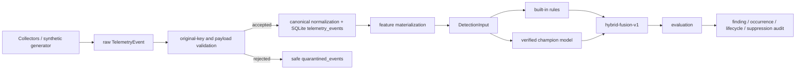

# Detection Engine

Stage 4 adds a local detection engine over Stage 2 feature windows and Stage 3 verified
champion models. It does not replace Stage 3 training, evaluation, registry, promotion,
rollback, scoring, or drift.

Detection flow:

`DetectionInput` contains only window id, dataset kind, pseudonymous profile key, window
start/end, feature schema version, ordered `FEATURE_NAMES`, numeric feature values,
quality, and feature input hash. It excludes raw events, payloads, user names, host names,
executable paths, remote addresses, authentication identities, command lines, and
synthetic scenario labels.

SQLite schema v9 adds detection policies, runs, evaluations, findings, occurrences,
lifecycle history, suppressions, watermarks, and worker leases. Idempotency is keyed by
window id, feature input hash, policy hash, and model identity sentinel.

Model signals are loaded only through the public Stage 3 verifier and SQLite registry.
User-supplied artifact paths are not accepted. Direct persisted feature-window scoring is
allowed only for detection, not for training, calibration, evaluation, promotion, or
drift.
