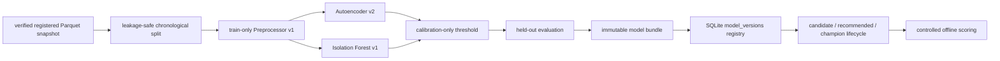

# ML Pipeline

Stage 3 trains and scores only from verified registered Parquet snapshots. It does not train directly from mutable SQLite feature windows.



Synthetic snapshots split at the first canonical scenario window. Earlier normal windows are divided into train and calibration, and all scenario windows remain in test. Scenario labels are used only for held-out metrics and recommendation. They are never feature columns, training targets, preprocessor inputs, or calibration inputs.

Real snapshots use chronological 70/15/15 splits over good windows only. Real data is unlabeled, so evaluation reports flagged rate, score percentiles, timing, and limitations. It does not report precision, recall, F1, ROC-AUC, PR-AUC, or accuracy for real data.

Scores are normalized by contract: higher score means more anomalous for both model families.

Commands:

```bash
sentinelueba ml train --dataset synthetic --seed 42
sentinelueba ml status
sentinelueba ml runs list
sentinelueba ml models list
sentinelueba ml evaluate <model-id>
sentinelueba ml score --dataset <dataset-id> --model <model-id>
sentinelueba ml drift --model <model-id> --dataset <dataset-id>
```
