# ML Pipeline

Stage 3 trains and scores only from verified registered Parquet snapshots. It does not train directly from mutable SQLite feature windows.

```mermaid
flowchart LR
  A["verified registered Parquet snapshot"] --> B["leakage-safe chronological split"]
  B --> C["train-only Preprocessor v1"]
  C --> D["Autoencoder v2"]
  C --> E["Isolation Forest v1"]
  D --> F["calibration-only threshold"]
  E --> F
  F --> G["held-out evaluation"]
  G --> H["temp model bundle + internal verify"]
  H --> I["atomic rename + SQLite model_versions registry"]
  I --> J["private pending registered verify"]
  J --> K["atomic success finalize + verified_at"]
  K --> L["public verify/load/lifecycle"]
  L --> M["batch offline scoring + drift reports"]
```



Synthetic snapshots split at the first canonical scenario window. Earlier normal windows are divided into train and calibration, and all scenario windows remain in test. Scenario labels are used only for held-out metrics and recommendation. They are never feature columns, training targets, preprocessor inputs, or calibration inputs.

Real snapshots use chronological 70/15/15 splits over good windows only. The same real training gate is applied by legacy `train-real`, CLI `ml train`, `POST /ml/train`, and direct `Stage3MLService.train`, including explicit `dataset_id` requests. The gate requires a verified real snapshot, exactly one profile, compatible feature schema/order, at least 96 good windows, 24 usable hours, cumulative collection duration that covers usable coverage, and core process/system coverage.

Real data is unlabeled, so evaluation reports split ranges, threshold, calibration/test flagged rates, score percentiles, highest-scoring windows, feature distribution summary, stability summary, timing, and limitations. It does not report precision, recall, F1, ROC-AUC, PR-AUC, or accuracy for real data.

Scores are normalized by contract: higher score means more anomalous for both model families.

Commands:

```bash
sentinelueba ml train --dataset synthetic --seed 42
sentinelueba ml train --dataset synthetic --autoencoder-epochs 20 --if-n-estimators 32
sentinelueba ml status
sentinelueba ml runs list
sentinelueba ml models list
sentinelueba ml models recommend <model-id> --confirm
sentinelueba ml evaluate <model-id>
sentinelueba ml score --dataset <dataset-id> --model <model-id> --batch-size 64
sentinelueba ml drift --model <model-id> --dataset <dataset-id>
```

Model bundle creation is all-or-nothing until finalization. The service writes a temporary directory, anchors split, preprocessor, metrics, model card, and model artifact hashes in `manifest.artifact_hashes`, writes `checksums.sha256`, performs internal verification without requiring a registry row, atomically renames to the final bundle path, registers `model_versions` with `verified_at = NULL`, and uses a private pending registered verifier while the training run is still `running`. After all candidates are registered and evaluated, one SQLite transaction marks the training run `success`, sets `completed_at`, and fills `verified_at` for every candidate model. Only finalized models can pass public verify/load/promote/recommend/retire/rollback/score/detect/drift/compare. Failures before finalization remove temp/final directories, remove registry/evaluation rows for the failed training run, and mark the training run failed with a sanitized error. Lifecycle recommendation or auto-promotion failures after finalization return a lifecycle warning without deleting verified candidates.

Offline scoring creates a `scoring_runs` row as `running` before compatibility/model loading. Scores are computed in bounded batches, `scored_windows` are inserted atomically on success, and failed runs store a sanitized error without partial scored rows.
