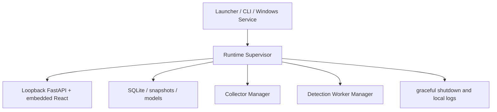

# Runtime Supervisor

Stage 5 introduces a single local host supervisor shared by desktop and service mode.

The supervisor resolves runtime paths, acquires a single-instance lock, verifies the installation
manifest in packaged mode, coordinates SQLite migration backup when needed, checks frontend assets,
selects a loopback port, starts Uvicorn in-process, writes safe status metadata, and cleans transient
control files only when it owns the current instance.

Readiness means the process, SQLite, runtime root, and packaged frontend are available. It does not
mean collectors are running, a champion model exists, or 24 hours of collection are complete.
The host does not publish `ready` or open the browser until Uvicorn has actually bound and answered a
loopback readiness probe.

`host doctor` is read-only. It inspects the SQLite schema and reports `migration_required` for older
databases instead of silently migrating them. Packaged host startup uses a SQLite backup coordinator
that copies via the SQLite backup API, verifies `PRAGMA integrity_check`, fsyncs the backup, writes
metadata, and applies retention before migration.
