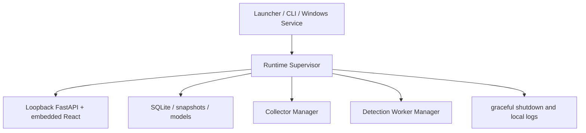

# Runtime Supervisor

Stage 5 introduces a single local host supervisor shared by desktop and service mode.

The supervisor resolves runtime paths, acquires a single-instance lock, verifies the installation
manifest in packaged mode, initializes SQLite, checks frontend assets, selects a loopback port,
starts Uvicorn in-process, writes safe status metadata, and cleans transient control files during
shutdown.

Readiness means the process, SQLite, runtime root, and packaged frontend are available. It does not
mean collectors are running, a champion model exists, or 24 hours of collection are complete.
